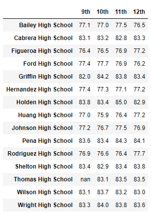
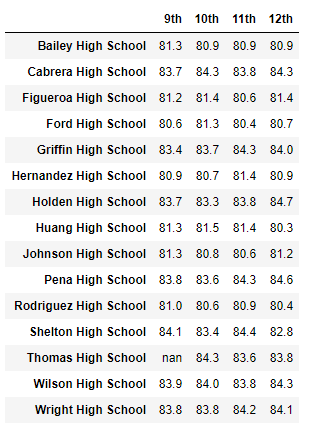

# School_District_Analysis
PyCitySchoools with Pandas

## Overview of the school district analysis
An existing school district analysis had completed and handed into Maria, a chief data scientist for a city school district. However, Maria asked us to refactor the existing analysis to provide an updated one by replacing the math and reading scores from 9th grade in Thomas High School with NaN while keeping the rest of the data intact. The update school district analysis shall reflect different average and passing percentage while excluding Thomas High School's 9th grade score.

## Result
1. How is district summary affected: 
   * The number of schools, students and budgets are the same.
   * Average Math score updates from 79 to 78.9 
   * Average Reading score is the same as 81.9
   * % Passing Math updates from 75 to 74.8
   * % Passing Reading updates from 85.8 to 85.7
   * % Overall Passing from 65.2 to 64.9
   * Existing district summary

   * Update district summary

 
2. How is school summary affected: 
   * Except Thomas High School, the rest school's information are the same as existing analysis.
   * Thomas High School's school type, total students, total school budget are the same as existing anlysis.
   * Thomas High School's Average Math score updates from 83.4 to 83.3
   * Thomas High School's Average Reading score updates from 83.8 to 83.9
   * Thomas High School's % Passing Math updates from 93.3 to 93.2
   * Thomas High School's % Passing Reading updates from 97.3 to 97
   * Thomas High School's % Overall Passing from 90.9 to 90.6
   * Existing School Summary

   * Update School Summary

3. How replace 9th grader's affect Thomas High School relative to the other schools:
   * Since count() function will count NaN in, if we don't remove 9th grader's count number from total student counts, we will get wrong average score and passing percentage. This is the reason why in step1 and step 2 we calculate new_student_count by deducting Thomas High School 9th grader count from student_count.
   * While in step 9 to 11 calculating Thomas High School average and passing percentage, we get the number of 10th to 12th graders counts only in step 5 in order to get correct base and denominator for step 6 to step 8.

4. How does replacing the ninth-grade scores affect the following:
   * Math and reading scores by grade: Except 9th grade in Thomas High School becomes NaN, the rest grades are the same.
     - Existing Math Score

       

     - Existing Reading Score
 
      
      
     - Update Math Score

      
      
     - Update Reading Score
  
      
 
   * Scores by school spending: Since Thomas High School spending range (per student) is $638, the average scores and passing percentages are affect in the range of $630-644.
     - Average Math score updates from 78.52 to 78.5
     - Average Reading score updates from 81.62 to 81.63
     - % Passing Math updates from 73.48 to 73.46
     - % Passing Reading updates from 84.39 to 84.32
     - % Overall Passing from 62.86 to 62.78
     - Existing Scores by school spending

      

     - Update Scores by school spending
 
      

   * Scores by school size: Although Thomas High School size is 1635, the average scores and passing percentages are not affect in the Medium (1000-2000).
     - Average Math score is the same as 83.4
     - Average Reading score is the same as 83.9
     - % Passing Math is the same as 94
     - % Passing Reading is the same as 97
     - % Overall Passing is the same as 91
     - Existing Scores by school size
     
      

     - Update Scores by school size
      

   * Scores by school type: Although Thomas High School type is Charter, the average scores and passing percentages are not affect in Charter.
     - Average Math score is the same as 83.5
     - Average Reading score is the same as 83.9
     - % Passing Math is the same as 94
     - % Passing Reading is the same as 97
     - % Overall Passing is the same as 90
     - Existing Scores by school type

      

     - Update Scores by school type
 
      

## Summary
After reading and math scores for the ninth grade at Thomas High School have been replaced with NaNs, there are following major changes.  
  1. The Average Math Scores, % Passing Math, % passing Reading, and % Overall Passing have been affected in district summary.
  2. The Average Math Scores, Average Reading Scores, % Passing Math, % passing Reading, and % Overall Passing have been affected in Thomas High School's summary.
  3. The math and reading score in 9th grade in Thomas High School has been affected, which turned into NaN.
  4. The Average Math Scores, Average Reading Scores, % Passing Math, % passing Reading, and % Overall Passing scores have been affected in scores by school spending.
